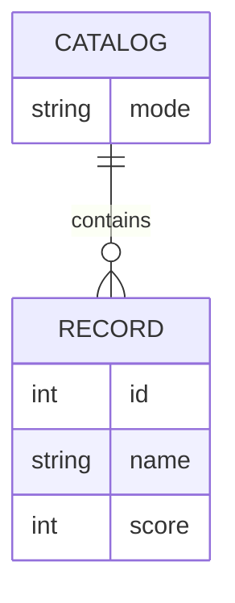

# Domain Model

The domain is a single catalog of scored records, held entirely by `service2`,
whose mode (full or empty) decides which records it currently contains.

- **Catalog** is a singleton: there is exactly one, held by `service2`, and its
`mode` (`full` or `empty`) decides whether it contains the ten seed records
or none. It starts in `full` mode.
- **Record** is fixed seed data (`id`, `name`, `score`) — never created,
updated, or deleted through any API; only the Catalog's mode changes which
records it currently holds.

