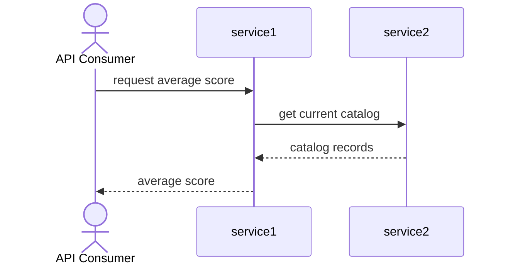

# Catalog Average Retrieval

An API Consumer asks `service1` for the average score; `service1` fetches the
current catalog from `service2` and computes the whole-number average.

```mermaid
sequenceDiagram
    actor Consumer as API Consumer
    participant service1
    participant service2

    Consumer->>service1: request average score
    service1->>service2: get current catalog
    service2-->>service1: catalog records
    service1-->>Consumer: average score
```

